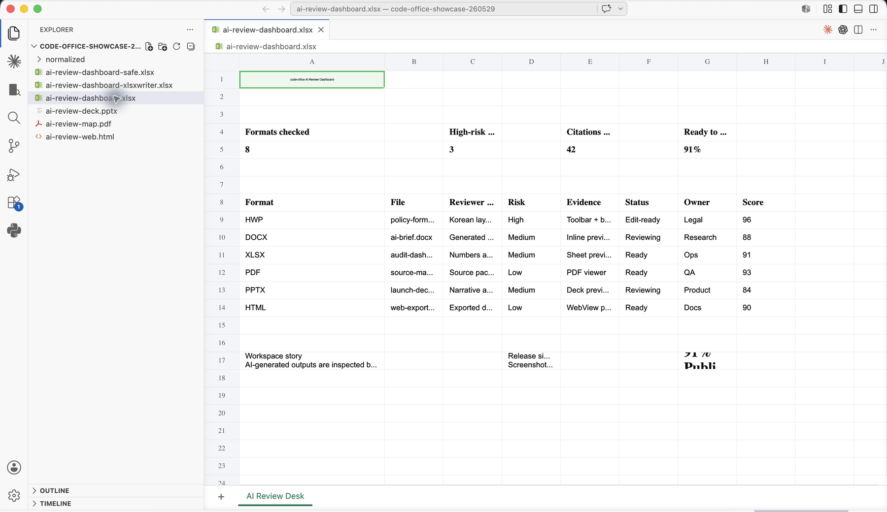
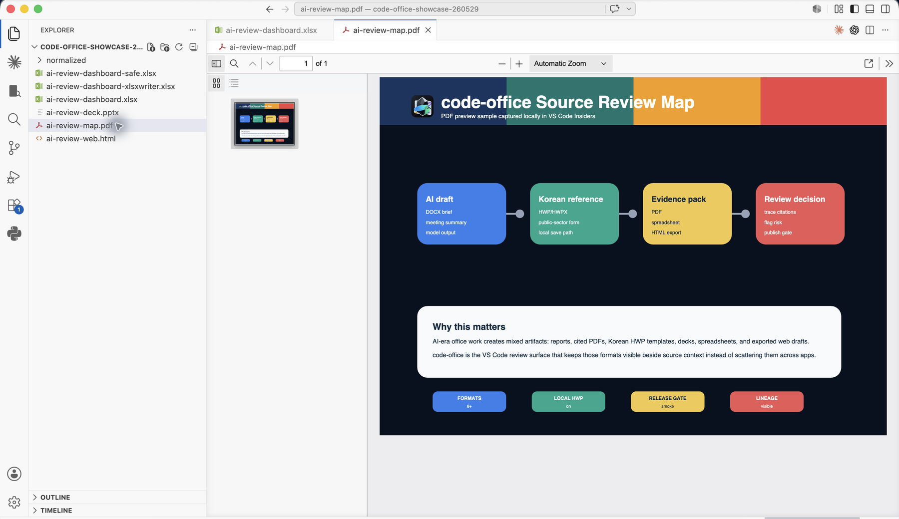
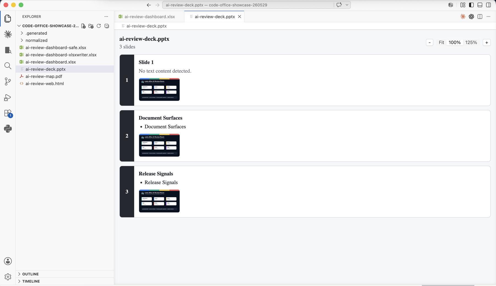
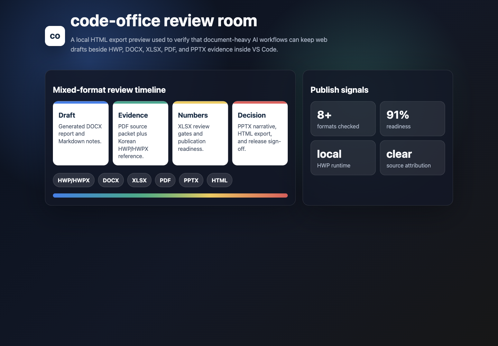

<p align="center">
  
</p>

# code-office

[English](README.md) | 简体中文 | [한국어](README-KO.md)

`code-office` 是一个独立的 VS Code 扩展，面向文档密集型工作区的打开、
审阅和编辑：韩国 HWP/HWPX、Markdown 笔记、Office 文件、PDF、压缩包、图片、
HTTP request 文件、Registry 文件和 HTML。

- 项目主页：<https://lidge-jun.github.io/code-office/>
- 仓库：<https://github.com/lidge-jun/code-office>
- 最新 VSIX：<https://github.com/lidge-jun/code-office/releases/latest>

核心差异是 **内置本地 rhwp-studio 运行时的 HWP/HWPX 编辑**。常见 `.hwp` /
`.hwpx` 文件默认无需 Hancom Office、LibreOffice 或远程服务即可打开、编辑和保存。

AI 工具会带来更多草稿、引用材料、会议记录和来源文档。这个扩展不声明提供 AI
生成能力；它提供的是 VS Code 内的文档审阅 surface，让生成的 DOCX 报告、
Markdown 笔记、韩国 HWP/HWPX 参考文件和需要确认 provenance 的资料留在同一个
workspace。

本项目不隶属于 Obsidian、Hancom、Microsoft、cweijan/vscode-office、
rjwang1982/vscode-office 或 rhwp，也不代表这些项目的官方立场。

## 差异点

- **HWP/HWPX 编辑器**：完整 rhwp 工具栏、文本编辑、表格/单元格选择、本地
  WASM 运行时、VS Code 原生保存流程。
- **格式感知保存**：HWP 写回 HWP bytes，HWPX 写回 HWPX zip/XML package，格式
  不匹配的输出会在写入磁盘前被拒绝。
- **Office 与 workspace preview**：Word、Excel、PDF、PowerPoint、图片、字体、
  压缩包、HTTP request、Registry、HTML。
- **Markdown 工作流**：基于 Vditor 的 Markdown 编辑，继承 PDF/DOCX/HTML 导出路径。
- **独立品牌表面**：repository metadata、GitHub Pages、package icon、README 和
  NOTICE 指向本项目，同时保留必要的 MIT 来源说明。

## 产品截图

以下截图来自本仓库的本地 smoke samples。Office/PDF/HWP 截图是在 VS Code
Insiders 中安装 packaged VSIX 后捕获的；HTML 截图使用同一个临时 review sample
直接渲染，便于做干净的视觉检查。临时样例生成在仓库外，因此不会修改 tracked
vendor documents。

<table>
  <tr>
    <td width="50%">
      <br>
      <strong>本地 HWP/HWPX 编辑</strong><br>
      bundled rhwp-studio runtime、完整工具栏、VS Code 保存 lifecycle。
    </td>
    <td width="50%">
      <br>
      <strong>DOCX 与 source context 审阅</strong><br>
      生成 brief 与 source notes 保留在同一个 workspace，而不是散落在多个 viewer。
    </td>
  </tr>
  <tr>
    <td width="50%">
      <br>
      <strong>XLSX review dashboard</strong><br>
      spreadsheet gates、owners、scores 与 publish readiness 可以在 workspace 内检查。
    </td>
    <td width="50%">
      <br>
      <strong>PDF evidence map</strong><br>
      source packets 与 provenance maps 可以留在 drafts 和 Korean office references 旁边。
    </td>
  </tr>
  <tr>
    <td width="50%">
      <br>
      <strong>PPTX text/media preview</strong><br>
      narrative decks 可用于轻量检查，更高 fidelity 仍在 roadmap 中推进。
    </td>
    <td width="50%">
      <br>
      <strong>HTML export review</strong><br>
      web drafts 也可以纳入 AI 时代的文档审阅流程。
    </td>
  </tr>
</table>

## 安装

从 GitHub Releases 下载最新 VSIX：

```bash
code --install-extension ./code-office-<version>.vsix
```

VS Code Insiders：

```bash
code-insiders --install-extension ./code-office-<version>.vsix --force
```

安装后打开支持的文件，并在 VS Code 询问编辑器时选择 `code-office`。
HWP/HWPX 文件仍通过继承的 `cweijan.hwpEditor` custom editor ID 注册，以保持
与既有 VS Code custom editor association 的兼容。

## 支持格式

| 格式 | 扩展名 | 模式 | 说明 |
| --- | --- | --- | --- |
| HWP / HWPX | `.hwp`, `.hwpx` | 可编辑 | 内置 rhwp-studio WASM。HWP 保存为 HWP，HWPX 保存为 HWPX。 |
| Markdown | `.md`, `.markdown` | 可编辑 | Vditor 编辑器，支持 PDF/DOCX/HTML 导出。 |
| Word | `.docx`, `.dotx` | 预览 | 基于 docx-preview/docxjs。 |
| Excel | `.xls`, `.xlsx`, `.xlsm`, `.csv`, `.ods` | 预览 / 既有编辑路径 | 继承 spreadsheet viewer。 |
| PowerPoint | `.pptx` | 只读预览 | 以文本/图片预览为主，尚不承诺 PowerPoint 级完整还原。 |
| Legacy PowerPoint | `.ppt` | 可选 fallback | LibreOffice opt-in，默认关闭。 |
| PDF | `.pdf` | 预览 | 内置 PDF viewer。 |
| 图片 | `.jpg`, `.png`, `.gif`, `.webp`, `.tif`, `.ico`, `.svg` | 预览 | 图片与 SVG preview。 |
| 字体 | `.ttf`, `.otf`, `.woff`, `.woff2` | 预览 | Font viewer。 |
| 压缩包 | `.zip`, `.jar`, `.vsix`, `.rar`, `.apk` | 预览 / extract | Zip/RAR package browsing。 |
| HTTP / REST | `.http`, `.rest` | Tooling | 继承 Rest Client 系列 helper。 |
| Windows Registry | `.reg` | 预览 / navigation | Registry syntax 与 jump helper。 |
| HTML | `.html`, `.htm` | 预览 | WebView HTML preview。 |

## HWP/HWPX 编辑

HWP 支持使用 [edwardkim/rhwp](https://github.com/edwardkim/rhwp) 的 pinned local
build。运行时保存在 `vendor/rhwp-studio-dist`，构建时复制到
`resource/rhwp-studio`。

```text
HWP/HWPX file
  -> HwpEditorProvider
  -> React HWP view
  -> local rhwp-studio bridge
  -> rhwp WASM document engine
  -> exportHwp/exportHwpx
  -> VS Code saveCustomDocument
```

当前可用能力：

- 使用完整 rhwp 工具栏打开 `.hwp` 和 `.hwpx`。
- 编辑文本并使用表格/单元格选择。
- 通过 `Cmd+S` / `Ctrl+S` 或工具栏按钮保存。
- 保留目标格式：`.hwp` 写回 HWP，`.hwpx` 写回 HWPX。
- 默认使用内置本地运行时，不依赖网络。

已知限制：

- rhwp 不是 Hancom Office 引擎，复杂文档可能存在 layout 或 round-trip 差异。
- 不内置 Hancom/Microsoft 专有字体，只使用开源字体和系统字体 fallback。
- `code-office.hwp.studioUrl` 是高级可信远程运行时 override，默认仍是本地 bundle。

## 设置

| 设置 | 默认值 | 用途 |
| --- | --- | --- |
| `code-office.hwp.experimentalSave` | `true` | 显示 HWP/HWPX 工具栏保存按钮。VS Code 原生保存仍可用。 |
| `code-office.hwp.studioUrl` | `""` | 可选可信远程 rhwp studio URL。留空则使用本地 bundle。 |
| `vscode-office.editorMode` | 继承值 | Markdown editor mode。 |
| `vscode-office.pptx.libreOfficePath` | `""` | legacy `.ppt` LibreOffice fallback 路径。 |
| `vscode-office.pptx.conversionTimeoutMs` | `30000` | optional LibreOffice conversion timeout。 |

部分 `vscode-office.*`、`office.*`、`cweijan.*` ID 为兼容已有设置、快捷键和
custom editor association 而保留。runtime ID migration 会作为单独阶段处理。
旧的 `vscode-obsdian.hwp.*` 值会作为 legacy fallback 读取；新的文档和 package
setting 以 `code-office.hwp.*` 为准。

## 发布检查

本地发布前请运行：

```bash
npm run release:local
```

该命令会依次执行 TypeScript 检查、production build、HWP hardening 校验、VSIX
打包，以及 VSIX 内容检查。它会确认扩展包包含本地 `rhwp-studio` runtime 和 WASM
资源，同时排除 upstream samples、vendor source、docs site 和开发脚本。
`npm run smoke` 也执行同一个完整 gate。

发布前手动 smoke test：

| 步骤 | 预期结果 |
| --- | --- |
| 安装生成的 VSIX 到 VS Code 或 VS Code Insiders。 | 扩展可激活，HWP/HWPX custom editor 可选。 |
| 打开 `.hwp`，修改并保存，关闭后重新打开。 | 文档仍可打开，保存后仍是 HWP。 |
| 打开 `.hwpx`，编辑文字，选择表格单元格，保存，关闭后重新打开。 | 文档仍可打开，保存后仍是 HWPX，表格/单元格交互正常。 |
| 打开 Markdown、HTML、XLSX、DOCX、PDF、PPTX、图片和压缩包样本。 | 既有 viewer/editor 路径仍可用。 |
| 检查 HWP 载入状态和保存 UI。 | 不再出现 stale loading banner 或错误的 Save As 提示循环。 |

Marketplace publish 是单独 gate：

```bash
npm run publish
```

该脚本先运行 `npm run release:local`，再调用 `vsce publish --no-dependencies`。

## GitHub Pages 与 logo

产品页位于 `docs/`，由 [.github/workflows/pages.yml](.github/workflows/pages.yml)
部署。它只是文档/营销页面；扩展运行时默认不依赖 GitHub Pages。

logo 源文件是 `images/logo-new.svg`，package icon 是 `images/logo-new.png`，
GitHub Pages preview 使用 `docs/assets/logo-new.png`。当前 logo 以 OpenAI 图片生成
concept 为起点，再手动简化为 SVG；它不是 upstream vscode-office artwork 或任何
third-party app logo 的派生图。

## Roadmap

- Obsidian-style `[[wikilink]]` completion、navigation、WebView/export integration。
- PPTX preview 稳定化。
- Markdown CJK inline formatting 和 strikethrough polish。
- Excel strikethrough/style preservation。
- 面向复杂 legacy presentation 的 optional LibreOffice fallback。
- HWP/HWPX fixture-based hardening 与 smoke test 扩展。

内部阶段记录见 [structure/roadmap.md](structure/roadmap.md)。

## 来源与许可

本项目包含 MIT 许可的 `vscode-office` 系列代码：

- [cweijan/vscode-office](https://github.com/cweijan/vscode-office)，Weijan Chen 的原始项目
- [rjwang1982/vscode-office](https://github.com/rjwang1982/vscode-office)，RJ.Wang 维护的 fork

HWP/HWPX 编辑使用 [edwardkim/rhwp](https://github.com/edwardkim/rhwp) 的本地构建。
完整声明见 [NOTICE.md](NOTICE.md) 与 [LICENSE](LICENSE)。
