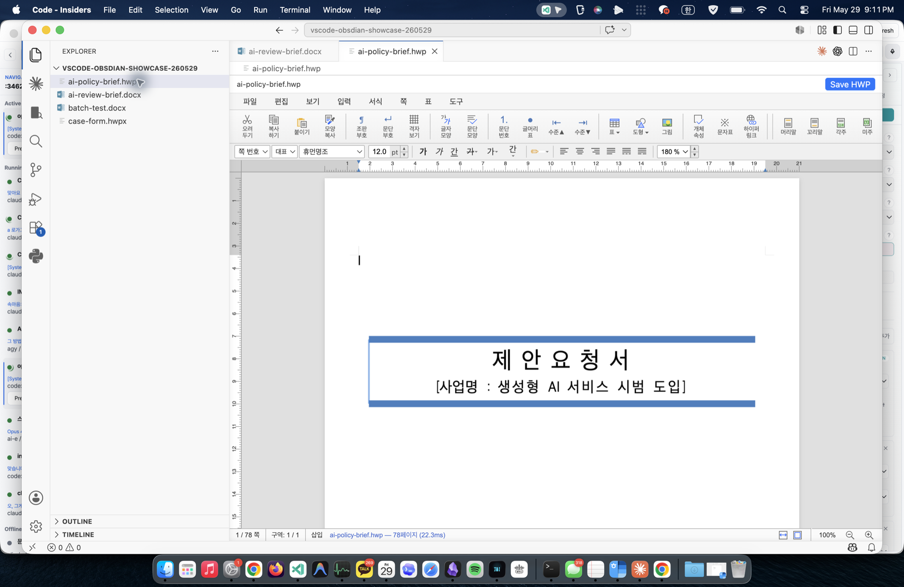
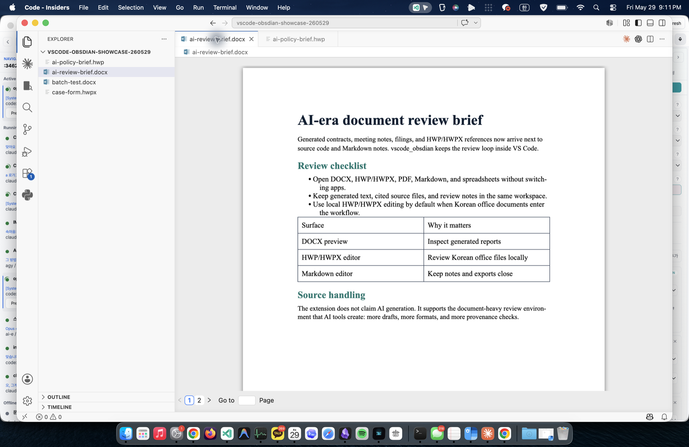

<p align="center">
  
</p>

# code-office

[English](README.md) | [简体中文](README-CN.md) | 한국어

`code-office`은 VS Code 안에서 문서 중심 작업을 검토하고 편집하기 위한 독립
확장입니다. Korean HWP/HWPX, Markdown 노트, Office 파일, PDF, 압축 파일,
이미지, HTTP request 파일, registry 파일, HTML을 한 workspace에서 열고 다룰
수 있게 하는 것이 목표입니다.

- 프로젝트 홈페이지: <https://lidge-jun.github.io/code-office/>
- 저장소: <https://github.com/lidge-jun/code-office>
- 최신 VSIX: <https://github.com/lidge-jun/code-office/releases/latest>

가장 큰 차별점은 **내장 로컬 rhwp-studio 런타임을 통한 HWP/HWPX 편집**입니다.
일반적인 `.hwp`와 `.hwpx` 파일을 한컴오피스, LibreOffice, 외부 서버 기본 의존성
없이 열고 편집하고 저장할 수 있습니다.

AI 도구가 만드는 초안, 인용 자료, 회의록, 소스 문서가 많아질수록 검토 surface가
여러 viewer로 흩어집니다. 이 확장은 AI 생성 기능을 주장하지 않습니다. 대신 생성된
DOCX 보고서, Markdown 노트, Korean HWP/HWPX 참고 문서, provenance 확인이 필요한
파일을 VS Code workspace 안에서 같이 검토할 수 있게 합니다.

이 프로젝트는 Obsidian, 한컴, Microsoft, cweijan/vscode-office,
rjwang1982/vscode-office, rhwp와 공식 제휴 관계가 없습니다.

## 차별점

- **HWP/HWPX 편집기**: rhwp 전체 툴바, 텍스트 편집, 표/셀 선택, 로컬 WASM
  런타임, VS Code 저장 lifecycle 연동.
- **포맷 보존 저장**: HWP는 HWP bytes로, HWPX는 HWPX zip/XML package로 저장하며,
  포맷이 맞지 않는 출력은 디스크 쓰기 전에 거부합니다.
- **Office와 workspace preview**: Word, Excel, PDF, PowerPoint, 이미지, 폰트,
  압축 파일, HTTP request, registry, HTML preview.
- **Markdown 작업**: Vditor 기반 Markdown 편집과 PDF/DOCX/HTML export 경로.
- **독립 브랜드 표면**: repository metadata, GitHub Pages, package icon, README,
  NOTICE를 새 프로젝트 기준으로 정리하되 MIT 계보는 보존합니다.

## 제품 스크린샷

아래 이미지는 packaged VSIX를 VS Code Insiders에 설치한 뒤 로컬에서 캡처했습니다.
DOCX brief는 screenshot smoke test를 위해 `officecli`로 생성했고, HWP 예시는
tracked vendor sample을 직접 수정하지 않도록 번들 rhwp sample을 임시 workspace로
복사해 열었습니다.

<table>
  <tr>
    <td width="58%">
      
    </td>
    <td width="42%">
      <strong>로컬 HWP/HWPX 편집</strong><br>
      번들 rhwp-studio runtime, 전체 toolbar surface, VS Code 저장 lifecycle로
      Korean office 문서를 VS Code 안에서 검토합니다.
    </td>
  </tr>
  <tr>
    <td width="42%">
      <strong>DOCX와 source context 검토</strong><br>
      생성된 brief, notes, PDF, spreadsheet, source file을 별도 viewer로 흩트리지
      않고 하나의 workspace에 둡니다.
    </td>
    <td width="58%">
      
    </td>
  </tr>
</table>

## 설치

GitHub Releases에서 최신 VSIX를 내려받아 설치합니다.

```bash
code --install-extension ./code-office-<version>.vsix
```

VS Code Insiders:

```bash
code-insiders --install-extension ./code-office-<version>.vsix --force
```

설치 후 지원 파일을 열면 VS Code가 editor 선택을 요청합니다. HWP/HWPX 파일은
기존 custom editor association과의 호환 때문에 `cweijan.hwpEditor` ID를 통해
등록되어 있습니다.

## 지원 형식

| 형식 | 확장자 | 모드 | 비고 |
| --- | --- | --- | --- |
| HWP / HWPX | `.hwp`, `.hwpx` | 편집 | 내장 rhwp-studio WASM 런타임. HWP는 HWP로, HWPX는 HWPX로 저장합니다. |
| Markdown | `.md`, `.markdown` | 편집 | Vditor 기반. PDF/DOCX/HTML export 지원. |
| Word | `.docx`, `.dotx` | Preview | docx-preview/docxjs 기반 렌더링. |
| Excel | `.xls`, `.xlsx`, `.xlsm`, `.csv`, `.ods` | Preview / 기존 편집 경로 | 상속된 spreadsheet viewer 사용. |
| PowerPoint | `.pptx` | 읽기 전용 preview | 텍스트/이미지 preview 중심. PowerPoint 수준 fidelity는 아직 목표가 아닙니다. |
| Legacy PowerPoint | `.ppt` | 선택적 fallback | LibreOffice opt-in 경로. 기본 비활성. |
| PDF | `.pdf` | Preview | 내장 PDF viewer. |
| 이미지 | `.jpg`, `.png`, `.gif`, `.webp`, `.tif`, `.ico`, `.svg` | Preview | 이미지와 SVG preview. |
| 폰트 | `.ttf`, `.otf`, `.woff`, `.woff2` | Preview | Font viewer. |
| 압축 | `.zip`, `.jar`, `.vsix`, `.rar`, `.apk` | Preview / extract | Zip/RAR package browsing. |
| HTTP / REST | `.http`, `.rest` | Tooling | 상속된 Rest Client 계열 helper. |
| Windows Registry | `.reg` | Preview / navigation | Registry syntax와 jump helper. |
| HTML | `.html`, `.htm` | Preview | WebView HTML preview. |

## HWP/HWPX 편집

HWP 지원은 [edwardkim/rhwp](https://github.com/edwardkim/rhwp)의 pinned local
build를 사용합니다. 런타임은 `vendor/rhwp-studio-dist`에 보관되고 build 중
`resource/rhwp-studio`로 복사됩니다.

```text
HWP/HWPX 파일
  -> HwpEditorProvider
  -> React HWP view
  -> local rhwp-studio bridge
  -> rhwp WASM document engine
  -> exportHwp/exportHwpx
  -> VS Code saveCustomDocument
```

현재 가능한 작업:

- `.hwp`와 `.hwpx`를 rhwp 전체 툴바로 엽니다.
- 텍스트 편집과 표/셀 선택을 사용할 수 있습니다.
- `Cmd+S` / `Ctrl+S` 또는 toolbar 버튼으로 저장합니다.
- `.hwp`는 HWP로, `.hwpx`는 HWPX로 보존 저장합니다.
- 기본값은 네트워크가 아니라 내장 로컬 런타임입니다.

알려진 제한:

- rhwp는 한컴오피스 엔진이 아니므로 복잡한 문서에서 layout/round-trip 차이가
  있을 수 있습니다.
- 한컴/Microsoft proprietary font는 번들하지 않습니다. 내장 오픈 폰트와 시스템
  폰트로 fallback합니다.
- `code-office.hwp.studioUrl`은 고급 trusted remote override이며 기본값은
  로컬 번들입니다.

## 설정

| 설정 | 기본값 | 설명 |
| --- | --- | --- |
| `code-office.hwp.experimentalSave` | `true` | HWP/HWPX 상단 저장 버튼 표시. VS Code 기본 저장도 계속 동작합니다. |
| `code-office.hwp.studioUrl` | `""` | 신뢰하는 remote rhwp studio URL. 비워두면 로컬 번들을 사용합니다. |
| `vscode-office.editorMode` | 기존값 | Markdown editor mode. |
| `vscode-office.pptx.libreOfficePath` | `""` | legacy `.ppt` fallback용 LibreOffice 경로. |
| `vscode-office.pptx.conversionTimeoutMs` | `30000` | optional LibreOffice conversion timeout. |

일부 `vscode-office.*`, `office.*`, `cweijan.*` ID는 기존 설정, 단축키,
custom editor association 호환을 위해 남겨두었습니다. Runtime ID migration은
별도 작업으로 다룹니다.
예전 `vscode-obsdian.hwp.*` 값은 legacy fallback으로 읽지만, 새 문서와 package
setting은 `code-office.hwp.*`를 기준으로 합니다.

## 릴리즈 검증

로컬 릴리즈 전에는 다음 명령을 실행합니다.

```bash
npm run release:local
```

이 명령은 TypeScript 검사, production build, HWP hardening 검증, VSIX 패키징,
VSIX 내용 검사를 순서대로 수행합니다. VSIX 안에 로컬 `rhwp-studio` runtime과
WASM 자산이 들어 있고, upstream samples, vendor source, docs site, 개발 스크립트가
빠져 있는지도 확인합니다. `npm run smoke`도 같은 full gate를 실행합니다.

배포 전 수동 smoke test:

| 단계 | 기대 결과 |
| --- | --- |
| 생성된 VSIX를 VS Code 또는 VS Code Insiders에 설치합니다. | 확장이 활성화되고 HWP/HWPX custom editor를 선택할 수 있습니다. |
| `.hwp` 파일을 열고 수정한 뒤 저장, 종료, 재오픈합니다. | 문서가 다시 열리고 저장 후에도 HWP입니다. |
| `.hwpx` 파일을 열고, 텍스트를 수정하고, 표 셀을 선택하고, 저장한 뒤 닫았다가 다시 엽니다. | 문서가 다시 열리고 저장 후에도 HWPX이며 표/셀 상호작용이 유지됩니다. |
| Markdown, XLSX, DOCX, PDF, PPTX, 이미지, 압축 파일 샘플을 엽니다. | 기존 viewer/editor 경로가 계속 동작합니다. |
| HWP 로딩 상태와 저장 UI를 확인합니다. | stale loading banner나 잘못된 Save As 반복 프롬프트가 남지 않습니다. |

Marketplace publish는 별도 gate입니다.

```bash
npm run publish
```

이 스크립트는 먼저 `npm run release:local`을 실행한 다음 `vsce publish
--no-dependencies`를 호출합니다.

## GitHub Pages와 로고

제품 페이지는 `docs/`에서 관리되고
[.github/workflows/pages.yml](.github/workflows/pages.yml)로 배포됩니다. 이 페이지는
문서/마케팅 surface일 뿐이며, 확장 런타임은 기본적으로 GitHub Pages를 사용하지
않습니다.

로고 원본은 `images/logo-new.svg`이고, package icon은 `images/logo-new.png`입니다.
GitHub Pages preview용으로 `docs/assets/logo-new.png`에도 복사합니다. 현재 로고는
OpenAI 이미지 생성 concept를 시작점으로 삼아 수동으로 SVG화한 프로젝트 전용
자산이며, upstream vscode-office 로고나 third-party app 로고에서 파생된 것이
아닙니다.

## Roadmap

- Obsidian-style `[[wikilink]]` completion, navigation, WebView/export integration.
- PPTX preview 안정화.
- Markdown CJK inline formatting과 strikethrough polish.
- Excel strikethrough/style preservation.
- 복잡한 legacy presentation을 위한 optional LibreOffice fallback.
- HWP/HWPX fixture 기반 hardening과 smoke test 확장.

자세한 내부 phase 기록은 [structure/roadmap.md](structure/roadmap.md)에 있습니다.

## 출처와 라이선스

이 프로젝트는 MIT 라이선스 기반 `vscode-office` 계열 코드를 포함합니다.

- [cweijan/vscode-office](https://github.com/cweijan/vscode-office), Weijan Chen의 원본 프로젝트
- [rjwang1982/vscode-office](https://github.com/rjwang1982/vscode-office), RJ.Wang의 유지 fork

HWP/HWPX 편집은 [edwardkim/rhwp](https://github.com/edwardkim/rhwp)의 로컬
빌드를 사용합니다. 자세한 고지는 [NOTICE.md](NOTICE.md)와 [LICENSE](LICENSE)에
있습니다.
